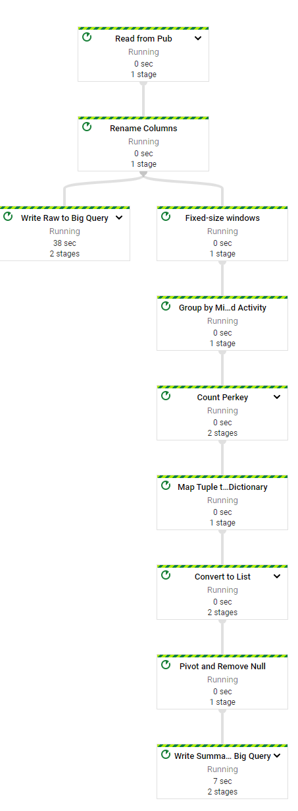

# StreamingAnalyticsWithGCP

## Project Description

In this post, I’ll be recreating a project my team worked on a while ago. We deployed a tool and we wanted to track our end user’s interaction with the tool. I learned a lot during the development of this project, so I decided to recreate it on GCP.

To learn more about this project, here is a link to the blog post I wrote in detail

https://medium.com/@ridwanibraheem1/streaming-data-processing-using-google-cloud-platform-e18f309518de

## Architecture Diagram 

 

## Data Pipeline

## Streaming Visuals

